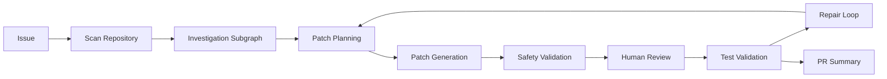

# RepoPilot

[English](README.md) | [简体中文](README_CN.md)

[](https://github.com/wzwz103053/repopilot-agent-code-maintenance/actions/workflows/ci.yml)

## Project Overview

RepoPilot is a LangGraph + LangChain multi-agent code maintenance system. It takes a repository issue, scans the codebase, routes the task, investigates likely root cause, plans a minimal patch, proposes a unified diff, runs safety checks, supports human review, applies approved patches, validates with tests, enters a repair loop when validation fails, and produces a PR-style summary.

The project is designed as a job-search portfolio project: it shows how to combine agent reasoning with deterministic engineering controls instead of letting an LLM freely edit a repository.

## Core Capabilities

- Repository scanning and code/document file summaries.
- Deterministic issue routing for `bug_fix`, `docs_update`, `test_generation`, `refactor`, `security_review`, and `unknown`.
- Retrieval-augmented investigation over repository code chunks.
- Specialized LLM agents for repository navigation, planning, patch writing, repair analysis, and PR summaries.
- Deterministic guardrails for prompt-injection-like text, secret redaction, forbidden paths, dangerous patch patterns, and patch/file scope.
- Patch proposal as unified diff before file modification.
- Human review with LangGraph interrupt before applying patches.
- Pytest validation and repair-loop routing.
- No-API unit/integration tests for deterministic logic.
- Reproducible Benchmark framework with fixed fixture repositories and dry-run mode.

## Architecture



The actual graph also includes preflight guardrails, issue routing, retrieval, a docs-update route, patch evaluation, and deterministic blocked/unsupported-route summaries.

## Agent And Deterministic Nodes

| Module | Type | Input | Output | Modifies Files | Safety Controls |
|---|---|---|---|---:|---|
| Preflight Guardrails | Deterministic Node | `repo_path`, `issue` | guardrail status/findings | No | Blocks unsafe repo paths and prompt-injection-like issue text. |
| Scan Repo | Deterministic Node | `repo_path` | code files, file tree, repo summary | No | Skips cache/build/virtualenv directories. |
| Issue Router | Deterministic Node | issue text, repo summary | route, confidence, candidates | No | Scores only issue text to avoid README filename bias. |
| Retrieval Subgraph | Subgraph / Tool | code files, issue | code chunks, retrieved files, context | No | Deterministic scoring; retrieved context is treated as hints. |
| Repo Navigator Agent | LLM Agent | issue, retrieved context, repo tools | root cause, evidence, relevant files | No | Must inspect files through tools; repo content is untrusted and redacted. |
| Planning Agent | LLM Agent | root cause, evidence, relevant files | files to modify, plan steps, risk | No | Stabilizer prefers direct root-cause files and minimal scope. |
| Docs Update Subgraph | Deterministic Node / Subgraph | docs issue, code files | docs target and docs plan | No | Limits docs route to README/docs-style files. |
| Patch Writer Agent | LLM Agent | plan, allowed files, safety notes | unified diff proposal | No | Patch must target only `files_to_modify`. |
| Patch Validator | Deterministic Node | patch proposal | diff shape and modified files | No | Rejects empty/non-unified diffs. |
| Patch Evaluator | Deterministic Node / optional LLM Agent | patch, route, plan, root cause | accepted/rejected, score, feedback | No | Deterministic checks run first; optional LLM evaluator can be disabled. |
| Patch Safety Guardrails | Deterministic Node | patch proposal, allowed files | safety status/findings | No | Blocks forbidden files, dangerous code, path drift, and secrets. |
| Human Review | Deterministic Node | patch payload | approve/reject/revise decision | No | Interrupts when `auto_approve=False`; only approval reaches apply. |
| Apply Patch | Tool / Deterministic Node | approved unified diff | patch status, modified files | Yes | Applies only validated unified diffs inside repo root. |
| Test Validation | Tool / Deterministic Node | repo path | pytest command/status/output | No | Uses current Python executable and bounded subprocess timeout. |
| Repair Subgraph | Subgraph / LLM Agents | failed test output, previous patch | repair patch and rerun tests | Yes, after patch apply | Repair attempts are capped. |
| PR Summary | LLM Agent / Deterministic fallback | final state | PR title, summary, checklist | No | Does not claim tests passed unless state says they passed. |

## Reliability And Safety

RepoPilot intentionally separates "thinking" from "acting":

- Agents propose JSON and unified diffs.
- Deterministic nodes validate route, patch shape, patch scope, safety, review decision, and test results.
- Repository file reads redact common secret patterns before content can reach an agent.
- Patch application happens only after validation and review.
- CI runs only tests that do not require API keys.

## Persistence And Human Review

The graph currently compiles with LangGraph `InMemorySaver`:

```python
checkpointer = InMemorySaver()
graph = builder.compile(checkpointer=checkpointer)
```

This supports process-local pause, resume, and human review when a stable `thread_id` is provided. It does not provide durable cross-restart recovery. Any README or demo language about checkpointing should be read as in-process resume support unless a durable checkpointer is added later.

## Quick Start

Install the project:

```powershell
python -m venv .venv
.\.venv\Scripts\Activate.ps1
python -m pip install -e .
```

Run deterministic tests:

```powershell
python -m pytest tests -q
```

Run local setup verification:

```powershell
python scripts/verify_local_setup.py
```

Run Benchmark dry-run mode with no LLM calls:

```powershell
python benchmark/run_benchmark.py --all --dry-run
```

For real Agent demos, configure provider environment variables locally or put them in a local `.env`. RepoPilot loads `.env` only when `load_config()` is called at an LLM boundary; deterministic tests, static imports, routing, and Benchmark dry-run do not require API keys. Set `PYTHON_DOTENV_DISABLED=true` to force-disable dotenv loading.

## Examples

Auto-approve demo:

```powershell
python examples/demos/final_auto_approve_demo.py
```

Human-review demo:

```powershell
python examples/demos/final_human_review_demo.py
```

Docs-update demo:

```powershell
python examples/demos/final_docs_update_demo.py
```

These demos may invoke configured LLM providers. Do not run them in environments where model calls, cost, or repository content exposure are not intended.

## Tests

Tests are organized by responsibility:

- `tests/unit/`: deterministic helpers, guardrails, routing, retrieval, patch evaluation, patch/test tools, and Benchmark helpers.
- `tests/integration/`: import and release-readiness smoke checks.
- `tests/e2e/`: graph-level checks that avoid LLM calls unless optional dependencies are installed.

Historical script-style tests were moved to `examples/legacy/`. See `docs/TEST_MIGRATION.md` for the migration map.

## Benchmark

The Benchmark framework lives in `benchmark/`:

- `benchmark/cases.json`: fixed case metadata.
- `benchmark/fixtures/`: lightweight fixture repositories.
- `benchmark/run_benchmark.py`: CLI runner supporting `--case`, `--all`, and `--dry-run`.
- `benchmark/results/`: timestamped local JSON/CSV outputs, ignored by Git except `.gitkeep`.

No benchmark score is reported in this README because no real graph benchmark run has been executed and verified as part of this documentation update. See `docs/BENCHMARKING.md`.

## Project Structure

```text
repopilot/
├── repopilot_agent/
│   ├── agent.py
│   ├── state.py
│   ├── agents/
│   ├── nodes/
│   ├── schemas/
│   ├── subgraphs/
│   └── tools/
├── benchmark/
├── docs/
├── examples/
├── playground_repo/
├── scripts/
├── tests/
├── .github/workflows/ci.yml
├── langgraph.json
├── pyproject.toml
└── README.md
```

## Design Decisions

- Use LangGraph for control flow and LangChain agents only where dynamic reasoning is useful.
- Delay LLM configuration and optional `.env` loading until an LLM boundary is reached.
- Keep deterministic tests and Benchmark dry-run independent of API keys.
- Keep legacy compatibility helpers documented as compatibility layers, not current core capabilities.

## Known Limitations

- The current Benchmark and demo repositories are intentionally small fixtures, not broad real-world repository coverage.
- LLM outputs can be unstable across providers, model versions, prompts, and local configuration.
- Patch proposals must pass validation, safety checks, tests, and human review before they should be trusted.
- RepoPilot does not guarantee automatic repair for arbitrary repositories or arbitrary bugs.
- In-memory checkpointing supports process-local resume only; durable cross-restart persistence is not implemented yet.

## Roadmap

- Add a durable checkpointer for cross-process recovery.
- Expand Benchmark fixtures and add larger repository scenarios.
- Add fake-agent e2e coverage for the successful patch path without real LLM calls.
- Replace legacy compatibility nodes with either maintained deterministic implementations or documented removals.

## Documentation

- [Architecture](docs/ARCHITECTURE.md)
- [Design Decisions](docs/DESIGN_DECISIONS.md)
- [Benchmarking](docs/BENCHMARKING.md)
- [Test Migration](docs/TEST_MIGRATION.md)
- [Release Readiness](docs/RELEASE_READINESS.md)
