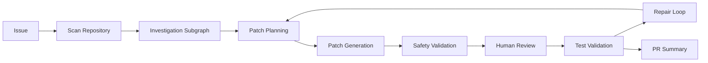

# RepoPilot

[English](README.md) | [简体中文](README_CN.md)

[](https://github.com/wzwz103053/repopilot-agent-code-maintenance/actions/workflows/ci.yml)

## 项目概览

RepoPilot 是一个基于 LangGraph 和 LangChain 的多 Agent 代码维护系统。它接收仓库问题描述，扫描代码仓库，进行任务路由，检索相关代码，调查根因，生成最小补丁计划，提出 unified diff，经过安全验证和人工审核后应用补丁，运行测试，必要时进入修复循环，并生成 PR 风格总结。

这个项目用于展示 Agent 工程能力：LLM 负责动态推理和补丁提议，确定性节点负责路由、安全边界、审批、测试和状态控制。

## 核心能力

- 扫描代码和文档文件，生成文件树和仓库摘要。
- 通过确定性规则识别 `bug_fix`、`docs_update`、`test_generation`、`refactor`、`security_review` 和 `unknown`。
- 基于代码 chunk 的检索增强调查。
- 使用专门 Agent 进行仓库导航、补丁规划、补丁生成、修复分析和 PR 总结。
- 对 prompt injection 类文本、常见密钥模式、危险补丁路径和危险代码模式做 Guardrails 检查。
- Agent 只提出 unified diff，不直接写文件。
- 支持基于 LangGraph interrupt 的人工审核。
- 支持 pytest 验证和失败后的 repair loop 路由。
- 默认测试和 Benchmark dry-run 不依赖 API Key。

## 系统架构



实际主图还包含 preflight guardrails、issue router、retrieval subgraph、docs update route、patch evaluator，以及 blocked/unsupported route 的确定性总结。

## Agent 与确定性节点

| Module | Type | Input | Output | Modifies Files | Safety Controls |
| ------ | ---- | ----- | ------ | -------------- | --------------- |
| Preflight Guardrails | Deterministic Node | `repo_path`, `issue` | guardrail 状态和 findings | No | 阻止不安全路径和 prompt-injection 类 issue。 |
| Scan Repo | Deterministic Node | `repo_path` | code files、file tree、repo summary | No | 跳过缓存、虚拟环境和构建目录。 |
| Issue Router | Deterministic Node | issue 文本 | route、confidence、candidates | No | 只基于用户 issue 评分，避免 README 文件名干扰。 |
| Retrieval Subgraph | Subgraph / Tool | code files、issue | retrieved files、retrieval context | No | 确定性检索，结果只作为调查线索。 |
| Repo Navigator Agent | LLM Agent | issue、repo tools、retrieval context | root cause、evidence、relevant files | No | 必须通过工具读文件；文件内容被视为不可信输入。 |
| Planning Agent | LLM Agent | root cause、evidence | files_to_modify、plan_steps | No | 规划稳定器偏向直接根因文件和最小修改。 |
| Docs Update Subgraph | Subgraph / Deterministic Node | docs_update issue | docs target、docs plan | No | 限定为 README/docs 类文档文件。 |
| Patch Writer Agent | LLM Agent | plan、allowed files | unified diff proposal | No | 只能针对 `files_to_modify` 生成补丁。 |
| Patch Validator | Deterministic Node | patch proposal | diff 形状和文件列表 | No | 拒绝空补丁和非 unified diff。 |
| Patch Evaluator | Deterministic Node / optional LLM Agent | patch、route、plan | accepted/rejected、feedback | No | 先跑确定性检查，可关闭 LLM evaluator。 |
| Patch Safety Guardrails | Deterministic Node | patch、allowed files | safety status | No | 阻止 forbidden files、危险代码和越界文件。 |
| Human Review | Human-in-the-loop | patch payload | approve/reject/revise | No | `auto_approve=False` 时暂停等待人工审核。 |
| Apply Patch | Tool | approved diff | patch status、modified files | Yes | 只在仓库根目录内应用已验证 diff。 |
| Test Validation | Tool | repo path | pytest result | No | 使用当前 Python 解释器，带超时控制。 |
| Repair Subgraph | Subgraph / LLM Agent | failed tests、previous patch | repair patch、rerun tests | Yes | 修复次数受上限控制。 |
| PR Summary | LLM Agent / deterministic fallback | final state | PR summary | No | 不会在状态未通过时声称测试已通过。 |

## 可靠性与安全性设计

- LLM 只负责调查、规划、生成和总结，不直接写文件。
- 真实写文件只发生在 patch validation、safety guardrails 和 human review 之后。
- `.env` 不会在普通 import 时读取；只有真正创建 LLM 配置时才会按环境允许延迟加载。
- CI 和默认测试不需要 API Key，也不调用真实 LLM。
- `InMemorySaver` 只支持进程内 human-review pause/resume，不支持跨重启恢复。

## 快速开始

```powershell
python -m venv .venv
.\.venv\Scripts\Activate.ps1
python -m pip install -e .
python -m pytest tests -q
python scripts/verify_local_setup.py
python benchmark/run_benchmark.py --all --dry-run
```

真实 Agent demo 需要本地环境变量或 `.env` 中已有模型配置。Benchmark dry-run、路由、检索和确定性测试不需要模型配置。

## 测试与 Benchmark

- `tests/unit/`：Issue Router、Guardrails、Retrieval、Patch tools、Benchmark schema 等确定性测试。
- `tests/integration/`：导入和 release-readiness smoke tests。
- `tests/e2e/`：不调用 LLM 的完整 blocked-flow 测试。
- `benchmark/`：固定 fixture repositories、`cases.json` 和 `run_benchmark.py`。

Dry-run：

```powershell
python benchmark/run_benchmark.py --dry-run
python benchmark/run_benchmark.py --case missing_user_profile --dry-run
python benchmark/run_benchmark.py --all --dry-run
```

真实 graph benchmark 可能调用配置的 LLM provider：

```powershell
python benchmark/run_benchmark.py --case missing_user_profile
python benchmark/run_benchmark.py --all
```

README 不包含任何未真实执行的 Benchmark 成功率或 Agent 修复率。

## 项目结构

```text
repopilot/
├── repopilot_agent/
├── benchmark/
├── docs/
├── examples/
│   ├── demos/
│   └── legacy/
├── playground_repo/
├── scripts/
├── tests/
└── .github/workflows/ci.yml
```

## 设计取舍

- 用 LangGraph 管控制流程，用 LangChain Agent 做动态推理。
- 保持 deterministic tests 默认可运行，避免 API Key 成为本地验证前提。
- Benchmark 框架先保证可复现和可审计，不伪造修复成功率。
- legacy compatibility 模块只服务旧节点导入，不代表当前核心能力。

## 当前限制

- 当前 Benchmark 和 demo fixture 仓库规模较小。
- LLM 输出会受模型、provider、prompt 和本地配置影响。
- Patch 必须经过安全验证、测试验证和人工审核。
- 当前不保证修复任意仓库、任意缺陷。
- 未配置模型环境时，只能运行 deterministic tests 和 Benchmark dry-run。
- 当前 `InMemorySaver` 不支持跨重启恢复。

## 后续计划

- 增加持久化 checkpointer。
- 扩展 Benchmark 到更大、更复杂的仓库。
- 增加 fake-agent 成功路径 e2e 测试。
- 清理或替换 legacy compatibility 层。

## 文档索引

- [Architecture](docs/ARCHITECTURE.md) / [架构说明](docs/ARCHITECTURE_CN.md)
- [Design Decisions](docs/DESIGN_DECISIONS.md) / [设计取舍](docs/DESIGN_DECISIONS_CN.md)
- [Benchmarking](docs/BENCHMARKING.md) / [Benchmark 说明](docs/BENCHMARKING_CN.md)
- [Test Migration](docs/TEST_MIGRATION.md) / [测试迁移](docs/TEST_MIGRATION_CN.md)
- [Release Readiness](docs/RELEASE_READINESS.md) / [发布准备](docs/RELEASE_READINESS_CN.md)
