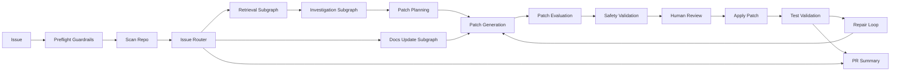

# RepoPilot Architecture

RepoPilot is a hybrid workflow-agent system for code maintenance.

## Layers

The outer LangGraph layer owns ordering, state transitions, branching, interrupt/resume, patch application, test validation, and repair-loop limits.

The inner LangChain agent layer owns tasks where repository-specific reasoning is useful: navigation, root-cause analysis, patch planning, patch writing, test-failure analysis, repair proposal, and PR summary generation.

## State

`RepoPilotState` carries the issue, repository scan output, route result, retrieval context, investigation evidence, patch plan, patch proposal, safety findings, review status, patch application result, test result, repair attempts, and final PR summary.

## Checkpointing

RepoPilot currently uses LangGraph `InMemorySaver`. That means human review and resume are supported only inside the current Python process when the same `thread_id` is used. Durable checkpoint recovery across process restarts is not implemented.

## Safety Boundaries

RepoPilot keeps file modification behind deterministic gates:

- Repository contents are treated as untrusted tool output.
- Common secret patterns are redacted before agent file reads.
- Patches are proposed as unified diffs.
- Patch shape, target files, dangerous patterns, forbidden paths, and test modifications are validated.
- Human review can approve, reject, or request revision.
- Tests run after patch application.
