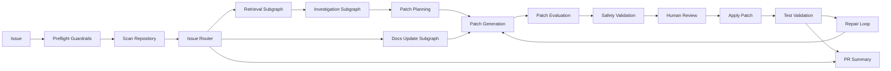

# RepoPilot 架构说明

RepoPilot 使用混合 workflow-agent 架构：外层 LangGraph 负责确定性流程控制，内层 LangChain Agents 负责需要动态推理的仓库调查、规划、补丁生成、修复和总结。

## 分层

LangGraph 层拥有状态流转、条件分支、interrupt/resume、补丁应用、测试验证和 repair loop 上限。

Agent 层负责仓库导航、根因分析、补丁计划、补丁生成、失败测试分析、修复补丁和 PR 总结。

## 状态

`RepoPilotState` 保存 issue、扫描结果、路由结果、检索上下文、调查证据、补丁计划、补丁 proposal、安全 findings、人工审核状态、应用结果、测试结果、修复次数和最终总结。

## Checkpoint

当前使用 `InMemorySaver`。这只支持同一 Python 进程内、同一 `thread_id` 下的 human-review pause/resume，不支持服务重启后的持久化恢复。

## 安全边界

- 仓库内容视为不可信工具输出。
- 常见密钥模式会在进入 Agent 前被 redaction。
- Patch 以 unified diff 形式提出。
- 文件范围、危险代码模式、禁止路径和测试文件修改会被检查。
- 人工审核通过后才应用补丁。
